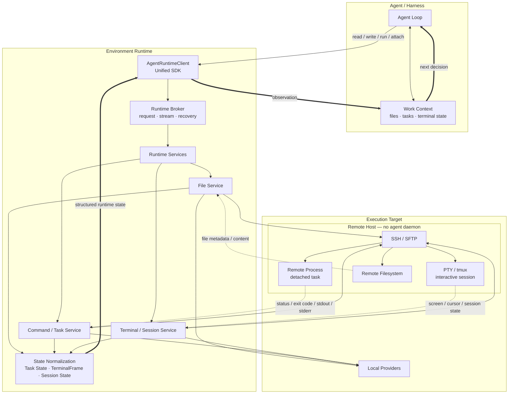
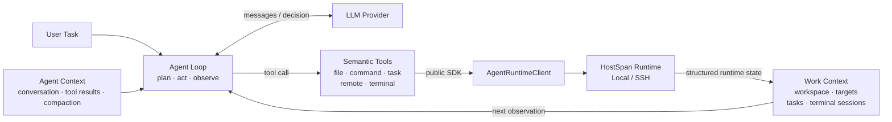
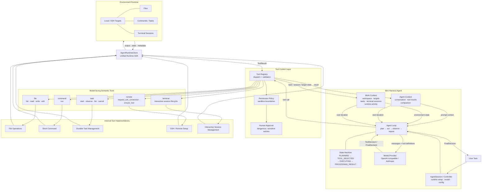

# HostSpan

**Stateful execution across local and remote hosts.**

HostSpan is a Python execution runtime for agent harnesses and developer automation. It gives the same high-level interface to local machines and SSH hosts for:

- file operations
- short and long-running commands
- durable tasks with persisted logs and recovery
- interactive PTY/tmux sessions
- replayable terminal output
- local broker and SDK access




HostSpan does **not** require a dedicated agent daemon on the remote machine, and it does not depend on any specific LLM or agent framework.

```text
Agent / Harness
      │
      ▼
AgentRuntimeClient
      │
      ▼
BrokerTransport
      │
      ▼
Local Broker
      │
      ▼
Services / Providers
      │
      ├──────── Local host
      │
      └──────── SSH host
```

The recommended integration path is:

```text
agent harness -> AgentRuntimeClient -> BrokerTransport -> local broker -> services/providers
```

The REST API and CLI remain available, but the broker-backed SDK is the primary integration surface.

---

## Why HostSpan?

Coding agents quickly outgrow a simple `run_command()` tool.

Real development work involves different execution lifecycles:

- a command that should return immediately
- a build or test process that may run for minutes
- a remote task that should survive a local runtime restart
- an interactive shell that needs PTY semantics
- a tmux-backed session that should remain attachable after disconnect
- files and workspaces that may live on either the local or a remote host

HostSpan treats these as runtime primitives instead of forcing every agent to reimplement them.

The goal is simple:

> **Keep agent logic focused on the task, while HostSpan owns execution, persistence, recovery, and host differences.**

---

## Highlights

### Unified local and SSH execution

Local and remote targets share the same runtime concepts:

- `Endpoint`
- `Environment`
- `ExecutionTarget`
- `Task`
- `Session`
- `Workspace`

Local filesystem access uses native filesystem operations. Remote filesystem access uses SFTP.

### Durable remote tasks

Persistent SSH tasks can outlive the local broker/runtime process.

HostSpan persists task metadata, tails remote logs through SFTP, reconciles final state, and recovers supported tasks after restart.

### Interactive terminals

HostSpan supports:

- `local_pty` for local interactive processes
- `ssh_pty` for direct live remote interaction
- `ssh_tmux` for durable remote sessions that can survive local restart

Terminal output is normalized into persisted `TerminalFrame` records so consumers can tail, replay, or stream terminal state.

### Broker-backed SDK

Agent-facing code does not need to call providers directly.

```python
from environment_runtime.sdk import AgentRuntimeClient

client = AgentRuntimeClient.from_broker(principal_id="agent-a")
print(client.broker.ping())
```

The SDK is intentionally transport-oriented so higher-level agent code can remain stable if additional transports are added later.

### Recovery as a runtime concern

On startup, HostSpan reconciles persisted live resources:

- local detached tasks from local status/log files
- SSH detached tasks from remote SFTP status/log files
- SSH tmux sessions by reattaching to the existing remote session
- non-durable PTY sessions as disconnected

---

## Quick Start

Install in development mode:

```bash
pip install -e ".[dev]"
```

Start the broker:

```bash
envrt broker serve
```

Then connect from Python:

```python
from environment_runtime.sdk import AgentRuntimeClient

client = AgentRuntimeClient.from_broker(principal_id="agent-a")

bundle = client.environments.ensure_local("local-dev", ".")
endpoint = bundle["endpoint"]
environment = bundle["environment"]
target_id = bundle["target_id"]

print(client.broker.ping())
```

Run a task:

```python
task = client.tasks.start(
    environment["environment_id"],
    target_id,
    ["python", "-c", "print('hello from HostSpan')"],
)

final = client.tasks.wait(task["task_id"], timeout_seconds=30)
print(final["state"], final["exit_code"])
```

Read and write files:

```python
endpoint_id = endpoint["endpoint_id"]

client.files.write_text(endpoint_id, "notes/hello.txt", "hello HostSpan")
print(client.files.read_text(endpoint_id, "notes/hello.txt"))
```

---

## Remote SSH Example

Create an SSH-backed environment:

```python
bundle = client.environments.ensure_ssh(
    name="remote-dev",
    hostname="127.0.0.1",
    port=2222,
    username="envrt",
    known_hosts_file="manual_ssh_test/known_hosts",
    identity_file="manual_ssh_test/envrt_test_key",
    use_ssh_agent=False,
)

endpoint_id = bundle["endpoint"]["endpoint_id"]
environment_id = bundle["environment"]["environment_id"]
target_id = bundle["target_id"]
```

The same SDK can now access remote files:

```python
client.files.write_text(
    endpoint_id,
    ".environment-runtime/probe.txt",
    "remote ok",
)

print(client.files.read_text(endpoint_id, ".environment-runtime/probe.txt"))
```

Start a persistent remote task:

```python
task = client.tasks.start(
    environment_id,
    target_id,
    ["bash", "-lc", "for i in 0 1 2 3; do echo TICK=$i; sleep 1; done"],
    persistent=True,
)

client.tasks.wait_for_log(task["task_id"], "TICK=2", timeout_seconds=20)
final = client.tasks.wait(task["task_id"], timeout_seconds=60)

print(final["state"], final["exit_code"])
```

Or create a durable remote terminal:

```python
session = client.sessions.create(
    environment_id,
    target_id,
    ["bash", "-l"],
    backend="ssh_tmux",
)

client.sessions.acquire_lease(session["session_id"], force=True)
client.sessions.write(session["session_id"], "echo hello-from-tmux\n")
print(client.sessions.tail_until(session["session_id"], "hello-from-tmux")["text"])
```

---

## Core Concepts

| Concept | Meaning |
| --- | --- |
| `Endpoint` | A concrete local or SSH machine/filesystem target. |
| `Environment` | A logical execution environment composed from one or more endpoints. |
| `ExecutionTarget` | The executable target inside an environment. |
| `Task` | A non-interactive command with persisted logs and final state. |
| `Session` | An interactive process/terminal with input, output, terminal frames, and optional durable backend. |
| `Workspace` | Metadata describing logical roots, replicas, and bindings. |
| `Broker` | A local per-project command surface used by agent harnesses and SDK transports. |
| `Principal` | Caller identity metadata used by broker authentication and writer leases. |

---

## Current Status

### Implemented

- Local endpoints with filesystem and process execution.
- SSH endpoints with strict known-host validation and identity-file/agent authentication.
- SFTP-backed remote filesystem access.
- Local process tasks with persisted logs.
- Local detached tasks with restart recovery.
- SSH detached persistent tasks with remote launcher upload, SFTP log tailing, remote status files, and restart recovery.
- Local interactive sessions.
- AsyncSSH PTY sessions for direct remote interactive use.
- SSH tmux-backed durable remote sessions with attach/recovery support.
- `TerminalFrame` persistence for replayable terminal output.
- Broker request/response commands over Windows Named Pipe or Unix socket.
- Broker streaming for runtime events and session terminal frames.
- Broker token authentication, principal metadata, and writer-lease enforcement.
- Agent-facing SDK facade using `BrokerTransport`.
- Workspace metadata, local snapshot revision, and local one-way mirror sync.
- Broker-level workspace commands and local/SFTP file commands.
- FastAPI routes and CLI commands for core runtime operations.
- Unit, integration, Docker SSH, recovery, broker, SDK, and tmux-oriented tests.

### Current limitations

- Workspace sync is intentionally simple and does not yet provide robust incremental SFTP directory sync, conflict detection, ignore rules, or bidirectional reconciliation.
- SSH `proxy_jump` is represented in endpoint config but not yet implemented.
- Non-persistent remote SSH tasks are not implemented; use `persistent=True`.
- WebSocket streaming is not implemented; broker streaming and polling are the current real-time alternatives.
- Reconnected detached remote tasks are tracked to completion, but cancellation after recovery is limited.
- `ssh_pty` sessions are tied to the live SSH channel; use `ssh_tmux` when restart durability is required.
- The legacy HTTP SDK remains intentionally small. Use `AgentRuntimeClient` for new integrations.

---

## Mini Harness

This repository also includes `mini_harness`, an optional reference coding-agent harness used to validate HostSpan through the same public SDK intended for external consumers. It is **not** required to use HostSpan; its purpose is to exercise the runtime as a real agent would and to provide a compact example of stateful local/remote integration.

### Agent structure

Mini Harness keeps the model loop small and treats HostSpan as the execution/state layer beneath it:



`Agent Context` tracks the conversation and model-facing history. `Work Context` tracks the execution environment: the active workspace/target, task inventory, terminal sessions, and recent runtime activity. The agent therefore does not have to reconstruct its current machine state from raw shell output on every turn.

### Model-facing tool facade

Mini Harness intentionally exposes **five semantic tool namespaces** instead of presenting every low-level runtime operation as a separate model tool. Each namespace validates an `action` and dispatches internally through the tool registry, permission/approval checks, and `AgentRuntimeClient`.

| Tool | Main actions | Intended use |
| --- | --- | --- |
| `file` | `list`, `read`, `write`, `edit` | Workspace file operations. The same model-facing interface can target local files or remote SFTP-backed files. |
| `command` | `run` | Short, clean, non-interactive commands such as checks, builds, tests, and inspections. If execution remains live, the returned task can be observed through `task`. |
| `task` | `start`, `observe`, `list`, `cancel` | Long-running non-interactive work with persisted identity, logs, state, and recovery semantics. |
| `remote` | `request_ssh_connection`, `ensure_tool` | Establish or request remote runtime access and check/install remote runtime prerequisites such as `tmux` when needed. |
| `terminal` | `open`, `list`, `inspect`, `activate`, `observe`, `command`, `control`, `human_input`, `close` | Stateful interactive work: PTY/tmux sessions, REPLs, foreground processes, control keys, sensitive-input handoff, and session continuity. |

This keeps the model-facing surface small while the implementation can still select the correct local/SSH provider, persistence behavior, terminal backend, and recovery path underneath.

```text
LLM decision
    │
    ▼
semantic tool facade
    │
    ▼
tool registry + validation
    │
    ├── permission / approval checks
    ▼
internal tool implementation
    │
    ▼
AgentRuntimeClient
    │
    ▼
HostSpan Runtime
    │
    ▼
ToolResult + Work Context update
    │
    └──────────────► next agent turn
```

<details>
<summary><strong>Detailed agent/tool flow</strong></summary>



</details>

The integration boundary remains the public HostSpan SDK:

```text
Mini Harness
     │
     ▼
AgentRuntimeClient
     │
     ▼
BrokerTransport
     │
     ▼
HostSpan
```

A deterministic local sample:

```powershell
.\.venv\Scripts\mini-harness.exe run --embedded-broker --fake-model --project tests\mini_harness\sample_project "Find why the tests fail, fix the code, and verify all tests pass."
```

Mini Harness supports TOML configuration for OpenAI-compatible APIs and Anthropic:

```toml
[model]
provider = "anthropic" # or "openai" / "openai-compatible"
model = "claude-your-model-name"
api_key = "..."
```

See `docs/mini-harness.md` and `MINI_HARNESS_STATUS.md` for architecture, commands, verification status, and current limitations.

---

## Validation

Run the regular validation suite:

```bash
python -m ruff check environment_runtime tests
python -m mypy environment_runtime
python -m pytest
```

For the optional Docker-backed SSH integration test:

```powershell
$env:ENVRT_TEST_SSH_DOCKER = "1"
.\.venv\Scripts\python -m pytest tests\integration\test_agent_sdk_remote_task.py -q
```

The SSH integration test covers:

- SDK `ensure_ssh`
- SFTP file write/read
- persistent remote task startup
- log polling through the SDK
- broker/runtime restart
- detached SSH task recovery
- final task state and exit code

---

## Architecture

HostSpan is organized into four main layers:

```text
environment_runtime/core
        │
        ▼
environment_runtime/services
        │
        ▼
environment_runtime/providers
        │
        ▼
api / cli / broker / sdk
```

- `environment_runtime/core`: resource models, IDs, events, domain errors, and shared concepts.
- `environment_runtime/services`: orchestration, validation, recovery, and state transitions.
- `environment_runtime/providers`: local/SSH transports, filesystems, execution backends, session backends, and sync adapters.
- `environment_runtime/api`, `environment_runtime/cli`, `environment_runtime/broker`, `environment_runtime/sdk`: user-facing adapters.

Important design rule:

```text
Business behavior belongs in services/providers.
Broker/API/CLI/SDK are adapters over those services.
```

---

## Broker Command Surface

Use this to discover the current canonical command set:

```python
commands = client.broker.commands()
for command in commands:
    print(command["method"], command["params_schema"])
```

Current groups:

- `broker.*`: status, command discovery, shutdown, event subscription.
- `endpoint.*`: local and SSH endpoint creation, listing, health checks.
- `env.*`: create/get/list and `ensure_local` / `ensure_ssh`.
- `workspace.*`: create/get/list, roots, replicas, bindings, revisions, sync.
- `file.*`: exists/stat/list/mkdir/remove/sha256/read/write for text and bytes.
- `task.*`: start/get/list/logs/cancel.
- `session.*`: create/get/list/write/resize/terminate/tail/frames/stream frames.

The broker validates command parameters with Pydantic models before dispatching to services.

## CLI Surface

The CLI remains useful for manual testing and local operation:

- `envrt endpoint add-local`
- `envrt endpoint add-ssh`
- `envrt endpoint list`
- `envrt endpoint health`
- `envrt env create`
- `envrt env list`
- `envrt env inspect`
- `envrt env reconcile`
- `envrt workspace create`
- `envrt workspace add-root`
- `envrt workspace add-replica`
- `envrt workspace bind`
- `envrt workspace revision`
- `envrt workspace sync`
- `envrt workspace status`
- `envrt task run`
- `envrt task start`
- `envrt task list`
- `envrt task inspect`
- `envrt task logs`
- `envrt task cancel`
- `envrt session create`
- `envrt session resize`
- `envrt session list`
- `envrt session inspect`
- `envrt session attach`
- `envrt session terminate`
- `envrt broker address`
- `envrt broker serve`
- `envrt broker call`
- `envrt broker shutdown`
- `envrt artifact list`
- `envrt artifact download`
- `envrt serve`

## REST API And Legacy SDK

The FastAPI app is still available:

```bash
envrt serve
```

The legacy SDK remains exported:

```python
from environment_runtime.sdk import AsyncEnvironmentRuntimeClient, EnvironmentRuntimeClient
```

For new agent harness work, prefer:

```python
from environment_runtime.sdk import AgentRuntimeClient
```

## Roadmap

High-value next steps:

- Use Mini Harness to identify the most painful SDK/workspace gaps.
- Improve workspace sync with SFTP directory upload/download, include/exclude rules, incremental revisions, and conflict strategy.
- Implement SSH `proxy_jump`.
- Add task log streaming as a first-class broker stream.
- Add WebSocket streaming on top of terminal frames/events for UI integrations.
- Improve cancellation for recovered remote detached tasks.
- Add resource ownership/scope enforcement beyond the current broker token/principal/writer-lease model.

