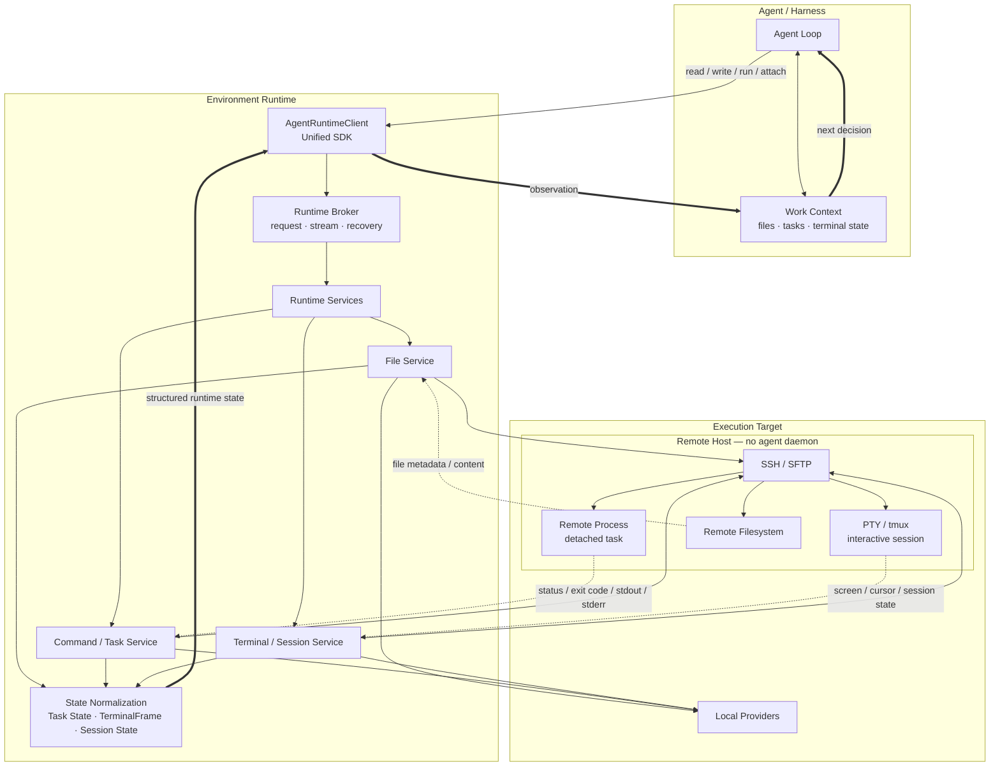
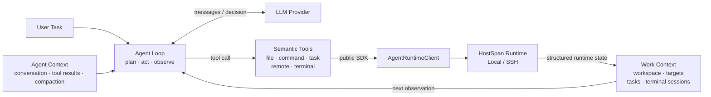
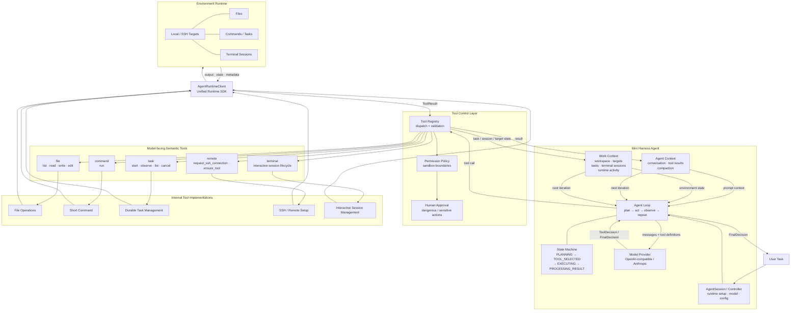

# HostSpan

**跨本地与远程主机的有状态执行引擎。** [English Version](README-EN.md)

HostSpan 是一个面向 Agent 的状态化执行 Runtime：它将本地与远程主机上的文件、进程、终端和任务统一抽象为同一套上下文，使 Agent 无需在远端部署专用服务，就能像操作本地环境一样持续执行、恢复和调试远程任务。基于这套基础设施 Agent 可以做到把远程和本地一视同仁，在一个会话里同时执行两个端点的任务。本框架支持以下核心能力：

* 文件操作
* 短期与长时间运行的命令
* 具备持久化日志和恢复能力的持久任务（Durable tasks）
* 交互式 PTY/tmux 会话
* 可重放的终端输出
* 本地 Broker（消息代理）与 SDK 访问

🚀 **快速体验**：下载mini-harness.exe，可直接使用以下命令唤起交互式 Agent[（点这里直接看 Agent 实现（跳过 Runtime 部分））](#mini-harness)：
```bash
# 将 <workspace-path> 替换为你的目标工作区路径，例如 "." 代表当前目录
mini-harness.exe chat --embedded-broker --project . --verbose
```



HostSpan **不需要**在远程机器上运行专用的 Agent 守护进程，也不依赖于任何特定的 LLM 或 Agent 框架。

```text
Agent / Harness
      │
      ▼
AgentRuntimeClient
      │
      ▼
BrokerTransport
      │
      ▼
Local Broker
      │
      ▼
Services / Providers
      │
      ├──────── Local host
      │
      └──────── SSH host

```

推荐的集成路径为：

```text
agent harness -> AgentRuntimeClient -> BrokerTransport -> local broker -> services/providers

```

现有的 REST API 和 CLI 依然可用，但基于 Broker 的 SDK 是目前主要推荐的集成界面。

---

## 为什么设计 HostSpan？

编程 Agent 的需求很快就会超越一个简单的 `run_command()` 工具所能提供的范畴。

真实的开发工作涉及多种不同的执行生命周期：

* 应该立即返回结果的命令
* 可能需要运行数分钟的构建或测试过程
* 在本地运行时重启后依然存活的远程任务
* 需要 PTY 语义的交互式 Shell
* 断开连接后仍可重新接入的基于 tmux 的会话
* 可能驻留在本地或远程主机上的文件和工作区

HostSpan 将这些能力抽象为基础的运行时原语（Runtime primitives），从而避免了每个 Agent 都需要重新实现一遍这些功能。

我们的目标很简单：

> **让 Agent 的逻辑专注于完成任务，而由 HostSpan 来全权负责执行、持久化、状态恢复以及屏蔽底层主机环境的差异。**

---

## 核心亮点

### 统一的本地与 SSH 执行

本地和远程目标共享同一套运行时概念：

* `Endpoint`
* `Environment`
* `ExecutionTarget`
* `Task`
* `Session`
* `Workspace`

本地文件系统访问使用原生的文件操作。远程文件系统访问则使用 SFTP。

### 持久化的远程任务

持久化的 SSH 任务（Persistent SSH tasks）的生命周期可以超越本地 Broker/运行时进程。

HostSpan 会持久化保存任务元数据，通过 SFTP 追踪（tail）远程日志，在结束时核对最终状态，并在重启后恢复受支持的任务。

### 交互式终端

HostSpan 支持以下模式：

* `local_pty`：用于本地交互式进程
* `ssh_pty`：用于直接、实时的远程交互
* `ssh_tmux`：用于支持本地重启后恢复的持久化远程会话

终端输出会被标准化并持久化保存为 `TerminalFrame` 记录，消费者可以通过它来实时追踪（tail）、重放或流式读取终端状态。

### 基于 Broker 的 SDK

面向 Agent 的代码无需直接调用底层 Provider。

```python
from environment_runtime.sdk import AgentRuntimeClient

client = AgentRuntimeClient.from_broker(principal_id="agent-a")
print(client.broker.ping())

```

SDK 采用面向传输层（transport-oriented）的设计，这样如果未来添加了其他的传输方式，上层 Agent 的代码仍能保持稳定。

### 将“状态恢复”视为运行时核心关注点

在启动时，HostSpan 会自动核对并恢复已持久化的存活资源：

* 通过本地状态/日志文件恢复本地的分离式任务（detached tasks）
* 通过远程 SFTP 状态/日志文件恢复 SSH 分离式任务
* 通过重新接入现有的远程会话来恢复 SSH tmux 会话
* 将非持久化的 PTY 会话标记为已断开（disconnected）

---

## 快速开始

以开发模式进行安装：

```bash
pip install -e ".[dev]"

```

启动 Broker：

```bash
envrt broker serve

```

然后在 Python 中建立连接：

```python
from environment_runtime.sdk import AgentRuntimeClient

client = AgentRuntimeClient.from_broker(principal_id="agent-a")

bundle = client.environments.ensure_local("local-dev", ".")
endpoint = bundle["endpoint"]
environment = bundle["environment"]
target_id = bundle["target_id"]

print(client.broker.ping())

```

运行一个任务：

```python
task = client.tasks.start(
    environment["environment_id"],
    target_id,
    ["python", "-c", "print('hello from HostSpan')"],
)

final = client.tasks.wait(task["task_id"], timeout_seconds=30)
print(final["state"], final["exit_code"])

```

读写文件：

```python
endpoint_id = endpoint["endpoint_id"]

client.files.write_text(endpoint_id, "notes/hello.txt", "hello HostSpan")
print(client.files.read_text(endpoint_id, "notes/hello.txt"))

```

---

## 远程 SSH 示例

创建一个基于 SSH 的环境：

```python
bundle = client.environments.ensure_ssh(
    name="remote-dev",
    hostname="127.0.0.1",
    port=2222,
    username="envrt",
    known_hosts_file="manual_ssh_test/known_hosts",
    identity_file="manual_ssh_test/envrt_test_key",
    use_ssh_agent=False,
)

endpoint_id = bundle["endpoint"]["endpoint_id"]
environment_id = bundle["environment"]["environment_id"]
target_id = bundle["target_id"]

```

使用相同的 SDK 访问远程文件：

```python
client.files.write_text(
    endpoint_id,
    ".environment-runtime/probe.txt",
    "remote ok",
)

print(client.files.read_text(endpoint_id, ".environment-runtime/probe.txt"))

```

启动一个持久化的远程任务：

```python
task = client.tasks.start(
    environment_id,
    target_id,
    ["bash", "-lc", "for i in 0 1 2 3; do echo TICK=$i; sleep 1; done"],
    persistent=True,
)

client.tasks.wait_for_log(task["task_id"], "TICK=2", timeout_seconds=20)
final = client.tasks.wait(task["task_id"], timeout_seconds=60)

print(final["state"], final["exit_code"])

```

或者创建一个持久化的远程终端：

```python
session = client.sessions.create(
    environment_id,
    target_id,
    ["bash", "-l"],
    backend="ssh_tmux",
)

client.sessions.acquire_lease(session["session_id"], force=True)
client.sessions.write(session["session_id"], "echo hello-from-tmux\n")
print(client.sessions.tail_until(session["session_id"], "hello-from-tmux")["text"])

```

---

## 核心概念

| 概念 | 含义 |
| --- | --- |
| `Endpoint` | 具体的本地或 SSH 机器/文件系统目标。 |
| `Environment` | 由一个或多个 Endpoint 组成的逻辑执行环境。 |
| `ExecutionTarget` | 环境内可执行的目标实例。 |
| `Task` | 非交互式的命令，拥有持久化的日志与最终状态记录。 |
| `Session` | 交互式进程/终端，包含输入、输出、终端帧序列（terminal frames），并支持可选的持久化后端。 |
| `Workspace` | 描述逻辑根目录、副本和绑定关系的元数据。 |
| `Broker` | 每个项目独立的本地命令接口，供 Agent 框架和 SDK 传输层调用。 |
| `Principal` | 调用者身份元数据，用于 Broker 身份验证和写入租约（writer leases）的强制执行。 |

---

## 当前状态

### 已实现的功能

* 本地 Endpoint（文件系统与进程执行）。
* SSH Endpoint（严格的 known-host 验证、密钥文件/SSH agent 认证）。
* 基于 SFTP 的远程文件系统访问。
* 具有持久化日志的本地进程任务。
* 支持重启恢复的本地分离式任务（detached tasks）。
* 支持远程启动器上传、SFTP 日志追踪、远程状态文件以及重启恢复的 SSH 分离式持久任务。
* 本地交互式会话。
* 用于直接远程交互的 AsyncSSH PTY 会话。
* 支持接入/恢复，基于 SSH tmux 的持久化远程会话。
* 支持持久化的 `TerminalFrame` 记录，实现终端输出的可重放。
* 基于 Windows 命名管道或 Unix 套接字的 Broker 请求/响应命令通信。
* 针对运行时事件和会话终端帧的 Broker 流式传输。
* Broker 令牌认证、身份（Principal）元数据以及写入租约机制。
* 基于 `BrokerTransport` 的面向 Agent 的 SDK 外观层（Facade）。
* 工作区元数据、本地快照修订版以及本地单向镜像同步。
* Broker 级别的工作区命令及本地/SFTP 文件命令。
* 用于核心运行时操作的 FastAPI 路由和 CLI 命令。
* 覆盖单元测试、集成测试、Docker SSH 测试、恢复测试、Broker 测试、SDK 及 tmux 的相关测试套件。

### 当前局限性

* 工作区同步（Workspace sync）被有意设计得较为简单，尚未提供强大的 SFTP 目录增量同步、冲突检测、忽略规则或双向协调功能。
* Endpoint 配置中预留了 SSH `proxy_jump`，但尚未实装。
* 尚未实现非持久化的远程 SSH 任务；请使用 `persistent=True` 代替。
* 尚未实现 WebSocket 流式传输；Broker 流式传输和轮询（polling）是目前的实时数据获取替代方案。
* 能够追踪重新连接后的远程分离式任务至完成状态，但恢复后的任务取消功能受限。
* `ssh_pty` 会话与活跃的 SSH 通道绑定；当需要重启持久性时，请使用 `ssh_tmux`。
* 遗留的 HTTP SDK 被刻意保持了极简状态。新集成请使用 `AgentRuntimeClient`。

---

## Mini Harness

本仓库还包含 `mini_harness`，这是一个可选的参考级代码 Agent 运行框架。它的作用是通过公开 SDK（外部消费者也会使用的 SDK）来验证 HostSpan 的可用性。使用 HostSpan **并不**强制要求使用它；它的存在是为了像真实的 Agent 那样去调用运行时，并提供一个紧凑的有状态本地/远程集成示例。

### Agent 结构

Mini Harness 保持了一个非常精简的模型循环，并将 HostSpan 作为其底层的执行与状态层：



`Agent Context` 负责追踪对话及面向模型的历史记录。`Work Context` 负责追踪执行环境状态：活动的工作区/目标、任务清单、终端会话以及近期的运行时活动。因此，Agent 不需要每一轮都从原始 Shell 输出中去艰难地重构当前的机器状态。

### 面向模型的工具门面 (Tool Facade)

Mini Harness 特意暴露了 **5 个语义化工具命名空间**，而不是将每个底层的运行时操作都单独作为一个模型工具呈现。每个命名空间负责验证对应的 `action`，并在内部通过工具注册表、权限/审批检查以及 `AgentRuntimeClient` 进行调度。

| 工具 (Tool) | 主要动作 (Actions) | 设计用途 |
| --- | --- | --- |
| `file` | `list`, `read`, `write`, `edit` | 工作区文件操作。相同的模型接口既可以操作本地文件，也可以操作基于 SFTP 的远程文件。 |
| `command` | `run` | 短暂、干净、非交互式的命令，如执行检查、构建、测试和代码探查。如果执行未能立即结束，返回的任务可以通过 `task` 工具进行观察。 |
| `task` | `start`, `observe`, `list`, `cancel` | 长时间运行的非交互式工作，具有持久化的身份、日志、状态和恢复语义。 |
| `remote` | `request_ssh_connection`, `ensure_tool` | 建立或请求远程运行时访问权限，并在需要时检查/安装远程运行时前置依赖（如 `tmux`）。 |
| `terminal` | `open`, `list`, `inspect`, `activate`, `observe`, `command`, `control`, `human_input`, `close` | 有状态的交互式工作：PTY/tmux 会话、REPL 交互环境、前台进程、控制键发送、敏感输入移交以及会话连贯性管理。 |

这使得面向模型的接口保持小巧，同时底层实现依然能够准确地选择正确的本地/SSH Provider、持久化行为、终端后端以及恢复路径。

```text
LLM decision
      │
      ▼
semantic tool facade
      │
      ▼
tool registry + validation
      │
      ├── permission / approval checks
      ▼
internal tool implementation
      │
      ▼
AgentRuntimeClient
      │
      ▼
HostSpan Runtime
      │
      ▼
ToolResult + Work Context update
      │
      └──────────────► next agent turn

```



系统集成的边界依然是公开的 HostSpan SDK：

```text
Mini Harness
      │
      ▼
AgentRuntimeClient
      │
      ▼
BrokerTransport
      │
      ▼
HostSpan

```

一个具备确定性的本地运行示例：

```powershell
.\.venv\Scripts\mini-harness.exe run --embedded-broker --fake-model --project tests\mini_harness\sample_project "Find why the tests fail, fix the code, and verify all tests pass."

```

Mini Harness 支持通过 TOML 文件配置兼容 OpenAI 格式的 API 以及 Anthropic 模型：

```toml
[model]
provider = "anthropic" # or "openai" / "openai-compatible"
model = "claude-your-model-name"
api_key = "..."

```

请参阅 `docs/mini-harness.md` 和 `MINI_HARNESS_STATUS.md` 以获取有关架构、命令、验证状态以及当前局限性的详细信息。

---

## 验证与测试

运行标准的验证套件：

```bash
python -m ruff check environment_runtime tests
python -m mypy environment_runtime
python -m pytest

```

运行可选的、基于 Docker 的 SSH 集成测试：

```powershell
$env:ENVRT_TEST_SSH_DOCKER = "1"
.\.venv\Scripts\python -m pytest tests\integration\test_agent_sdk_remote_task.py -q

```

SSH 集成测试覆盖了以下功能：

* SDK 的 `ensure_ssh`
* SFTP 文件的写入/读取
* 持久化远程任务的启动
* 通过 SDK 轮询日志
* Broker/运行时重启
* 分离式 SSH 任务恢复
* 任务的最终状态及退出码验证

---

## 架构概览

HostSpan 被划分为四个主要层级：

```text
environment_runtime/core
        │
        ▼
environment_runtime/services
        │
        ▼
environment_runtime/providers
        │
        ▼
api / cli / broker / sdk

```

* `environment_runtime/core`：定义资源模型、ID 生成、事件、领域错误以及共享的概念基石。
* `environment_runtime/services`：负责编排、校验、恢复以及状态流转。
* `environment_runtime/providers`：实现本地/SSH 传输、文件系统、执行后端、会话后端以及同步适配器。
* `environment_runtime/api`, `environment_runtime/cli`, `environment_runtime/broker`, `environment_runtime/sdk`：提供面向用户的访问适配器。

一项重要的设计原则：

```text
业务行为与逻辑只属于 services 和 providers 层。
Broker、API、CLI 和 SDK 仅仅是覆盖在这些服务之上的适配器。

```

---

## Broker 命令接口

你可以使用以下代码来发现当前支持的标准命令集合：

```python
commands = client.broker.commands()
for command in commands:
    print(command["method"], command["params_schema"])

```

当前支持的命令组：

* `broker.*`：状态查看、命令发现、关闭服务、事件订阅。
* `endpoint.*`：本地与 SSH endpoint 的创建、列表查询和健康检查。
* `env.*`：创建/获取/列表查询，以及 `ensure_local` / `ensure_ssh`。
* `workspace.*`：创建/获取/列表查询，根目录、副本、绑定、修订版、同步。
* `file.*`：存在性判断/状态查看/列表/创建目录/删除/sha256/针对文本及字节的读写。
* `task.*`：启动/获取/列表/日志查看/取消。
* `session.*`：创建/获取/列表/写入/调整窗口大小/终止/日志追踪/帧序列/流式帧序列。

Broker 在将请求分发到具体服务之前，会使用 Pydantic 模型对命令参数进行校验。

## CLI 接口

CLI 工具在手动测试和本地操作中依然非常实用：

* `envrt endpoint add-local`
* `envrt endpoint add-ssh`
* `envrt endpoint list`
* `envrt endpoint health`
* `envrt env create`
* `envrt env list`
* `envrt env inspect`
* `envrt env reconcile`
* `envrt workspace create`
* `envrt workspace add-root`
* `envrt workspace add-replica`
* `envrt workspace bind`
* `envrt workspace revision`
* `envrt workspace sync`
* `envrt workspace status`
* `envrt task run`
* `envrt task start`
* `envrt task list`
* `envrt task inspect`
* `envrt task logs`
* `envrt task cancel`
* `envrt session create`
* `envrt session resize`
* `envrt session list`
* `envrt session inspect`
* `envrt session attach`
* `envrt session terminate`
* `envrt broker address`
* `envrt broker serve`
* `envrt broker call`
* `envrt broker shutdown`
* `envrt artifact list`
* `envrt artifact download`
* `envrt serve`

## REST API 与旧版 SDK

FastAPI 应用依然受支持可用：

```bash
envrt serve

```

旧版的 SDK 同样保留了导出接口：

```python
from environment_runtime.sdk import AsyncEnvironmentRuntimeClient, EnvironmentRuntimeClient

```

对于新开发的 Agent 框架集成，我们推荐使用：

```python
from environment_runtime.sdk import AgentRuntimeClient

```

## 路线图 (Roadmap)

下一步的高价值迭代方向：

* 利用 Mini Harness 来识别目前 SDK/workspace 功能中最痛的短板。
* 通过引入 SFTP 目录级上传/下载、包含/排除规则、增量修订版以及冲突处理策略，来进一步改进工作区同步（Workspace sync）。
* 实装 SSH `proxy_jump` 功能，实现远程多端点支持。
* 将任务日志的流式传输（log streaming）提升为 Broker 中一等公民级别的 Stream 支持。
* 在事件/终端帧序列的基础上，增加 WebSocket 的流式传输能力，以更好地支持 UI 级别的集成。
* 改进恢复后的远程分离式任务的取消逻辑。
* 在现有的基于 Broker token/principal/writer-lease 的模型之外，实现更进一步的资源所有权与作用域强制管控。
